## Practicum Report

|  | Pemrograman Berbasis Framework 2026 |
|--|--|
| NIM |  2341720241|
| Nama |  Sherly Lutfi Azkiah Sulistyawati |
| Kelas | TI - 3I |
---

### Step 1 – Environment Check
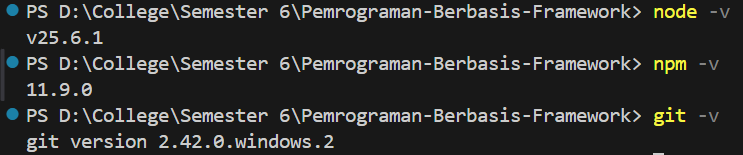

### Step 2 – Creating a Next.js Project
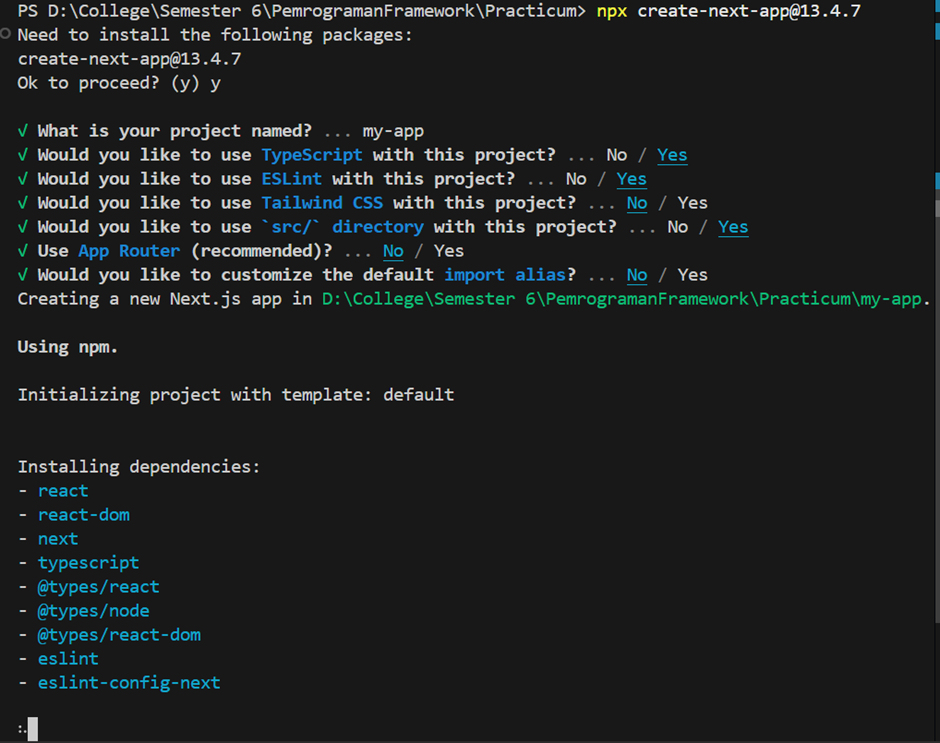
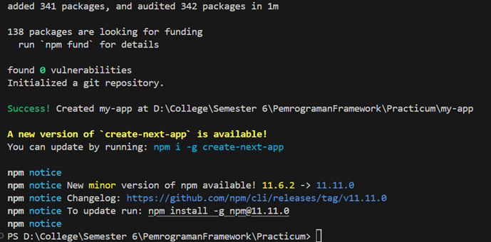

### Step 3 – Running the Development Server
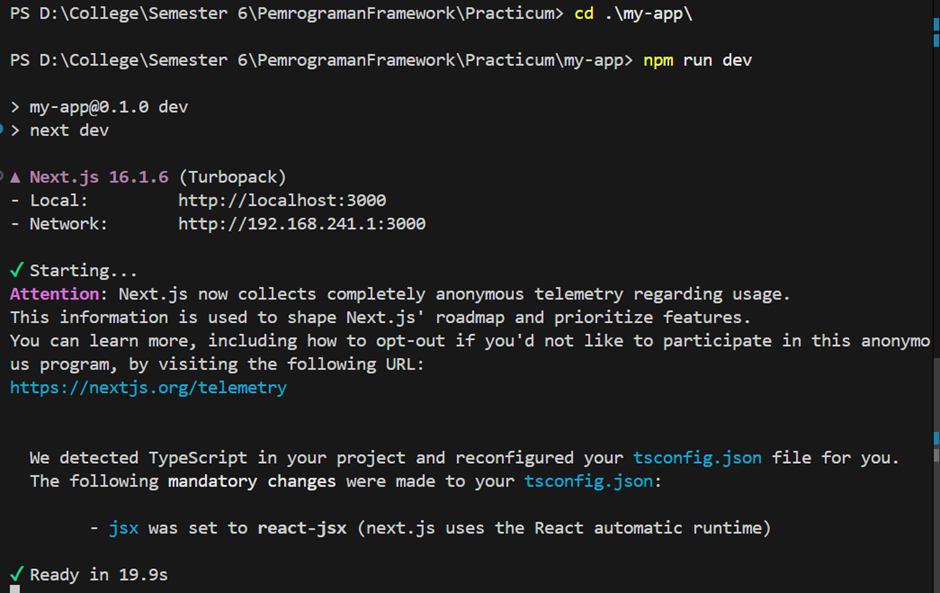
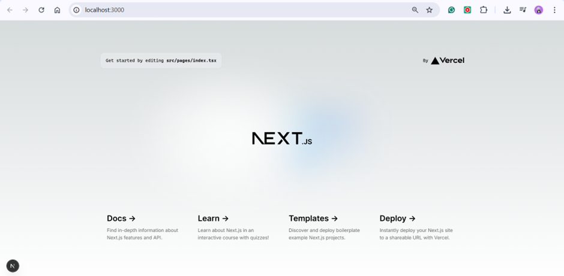

### Step 4 – Understanding the Folder Structure
- `pages/` → for page routing
- `public/` → static assets
- `styles/` → CSS files
- `package.json` → project configuration
- `.gitignore` → tells Git which files/folders to ignore

### Step 5 – Modify the Main Page
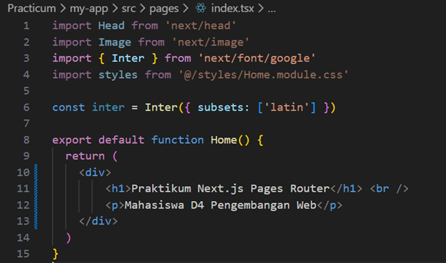
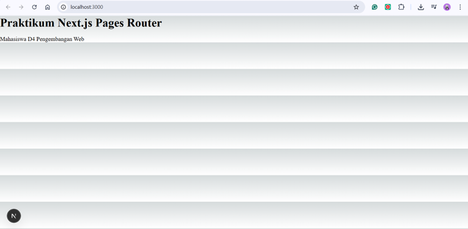

### Step 6 – Modify the API
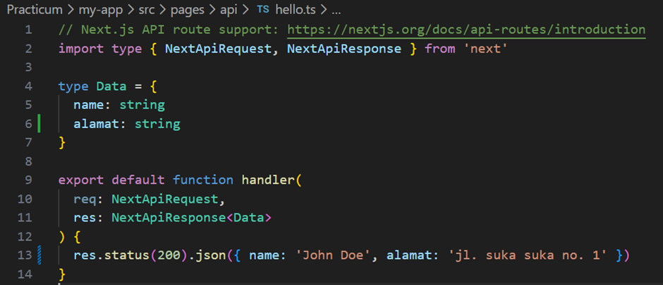
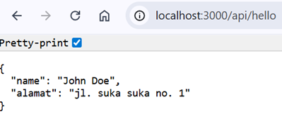
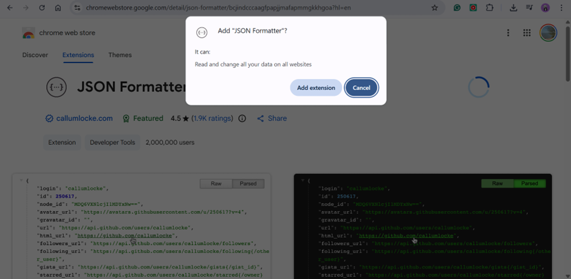
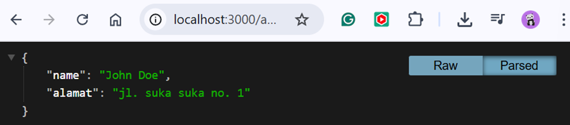

### Step 7 – Modify the Background
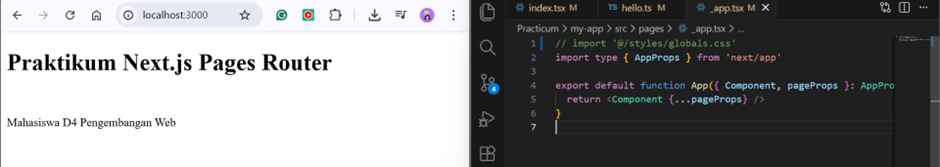

## Practical Tasks
### Task 1
- Create a new page `about.js` in the `pages` folder.
- Display:
  - Student Name
  - Student ID (NIM)
  - Study Program

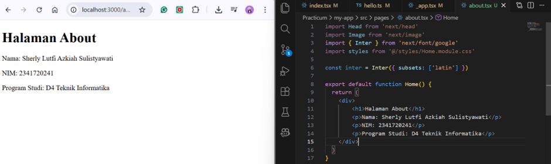

### Task 2
- Add at least one navigation link from the main page to the about page.

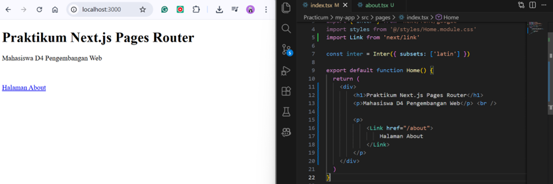
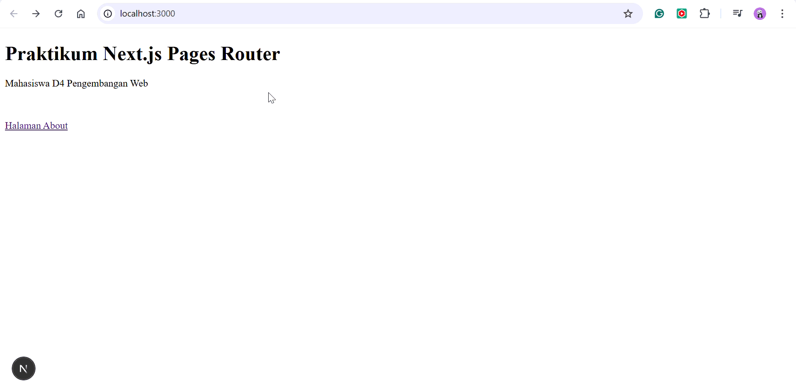

## Reflection Questions
**1. Why is the Pages Router called file-based routing?**
Because the routing system in Next.js (Pages Router) is determined directly by the file name and file structure inside the pages/ folder.

For example:
- pages/index.js → automatically becomes /
- pages/about.js → automatically becomes /about
- pages/contact.js → automatically becomes /contact

Therefore, we do not need to manually configure routing like in standard React. The routing is automatically created based on the file structure, which is why it is called file-based routing.

**2. What is the difference between Next.js and standard React (CRA)?**
Standard React applications are usually created using Create React App (CRA), while Next.js is a framework built on top of React.
| Feature                      | React (CRA)                            | Next.js                         |
| ---------------------------- | -------------------------------------- | ------------------------------- |
| Type                         | Only a UI library                      | A full framework based on React |
| Routing                      | Requires installing `react-router-dom` | Automatic routing (file-based)  |
| Server Side Rendering (SSR)  | Not available by default               | Supports SSR                    |
| Static Site Generation (SSG) | Not available                          | Supports SSG                    |
| API Routes                   | Not available by default               | Built-in API routes             |
| SEO                          | Less SEO-friendly                      | More SEO-friendly               |

**3. What is the function of the npm run dev command?**
The command is used to:
- Run the development server
- Start the application in development mode
- Enable hot reload (changes appear automatically without manually refreshing the browser)

**4. What is the difference between npm run dev and npm run build?**
| Aspect        | `npm run dev`                                | `npm run build`                                             |
| ------------- | -------------------------------------------- | ----------------------------------------------------------- |
| Mode          | Development mode                             | Production mode                                             |
| Usage         | Used during coding and development           | Used to prepare the app for production                      |
| Hot Reload    | Includes hot reload for instant updates      | No hot reload                                               |
| Optimization  | Not optimized yet                            | Generates optimized build files                             |
| Code          | Source code is not minified                  | Code is already minified                                    |
| Performance   | Slightly slower but flexible for development | Faster and optimized for deployment                         |
| After Command | Runs the development server directly         | Usually followed by `npm start` to run the production build |
